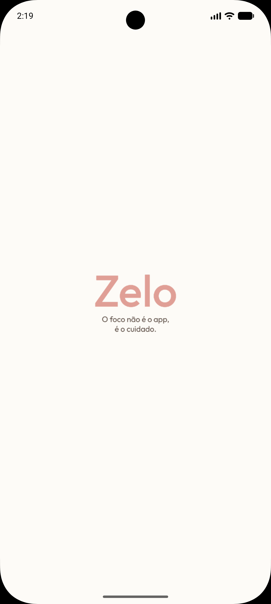
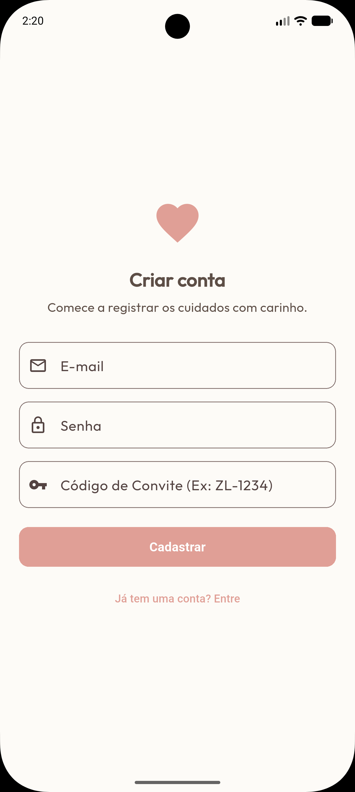
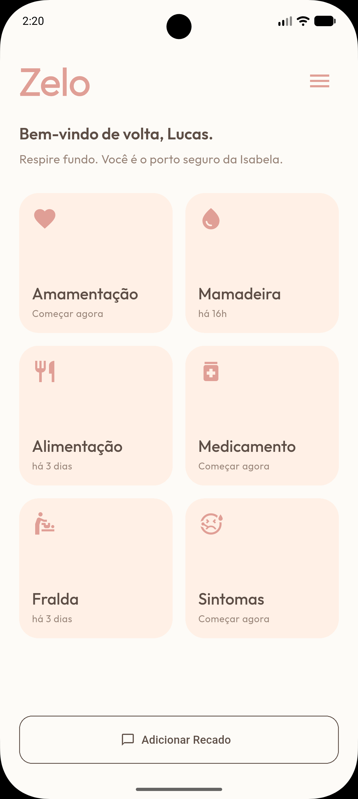
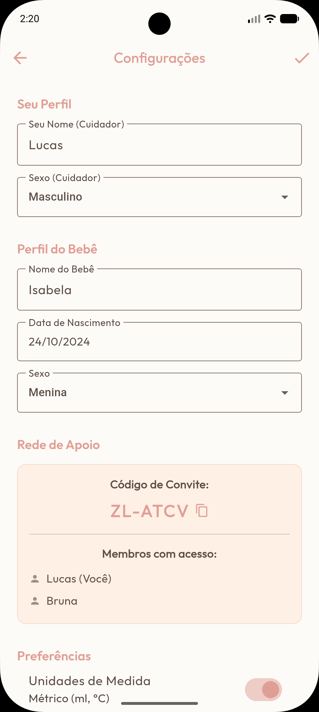
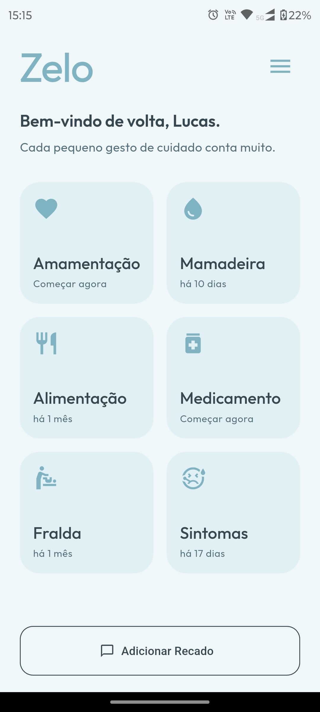
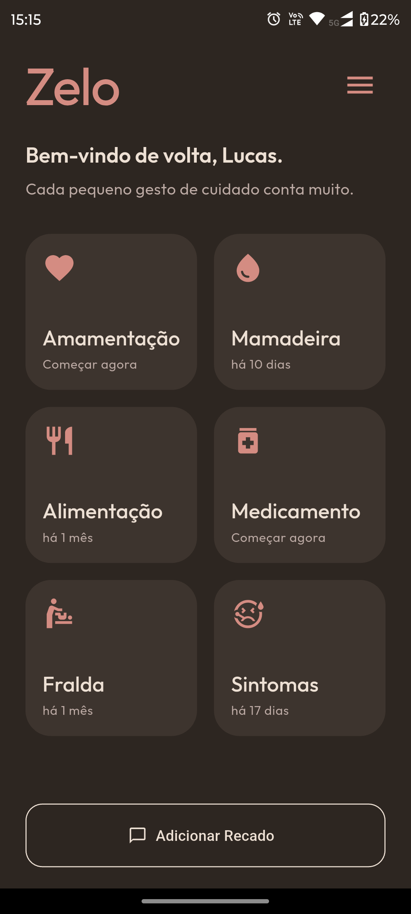

# Zelo

> *"O foco não é o app, é o cuidado."*

Zelo é um assistente parental de baixo esforço cognitivo, construído para pais e mães que estão operando no limite do cansaço — muitas vezes com uma mão só, às 2h da manhã, sem capacidade de navegar menus complexos.

Este repositório é uma **amostra técnica** do projeto. O código completo está em desenvolvimento privado.

---

## O Problema Real

Apps de registro para bebês existem aos montes. A maioria deles foi projetada para ser *completa* — cheia de gráficos, relatórios, configurações, notificações.

O problema: pais exaustos não precisam de mais informação. Precisam de **menos fricção**.

O Zelo nasceu de uma necessidade real. Cada decisão de design tem uma razão funcional — não estética.

---

## Telas

<p align="center">
  
  
  
  
</p>

---
### Sistema de Temas

<p align="center">
  
  
  
</p>

*Modo Sereno · Modo Claro · Modo Escuro — o tema acompanha o contexto do cuidador.*
---

## Decisões Técnicas

### Flutter + Firebase

Flutter foi escolhido pela capacidade de entregar uma UI fluida e responsiva com uma única base de código. Firebase resolve autenticação, persistência e sincronização em tempo real sem overhead de infraestrutura — permitindo foco total na experiência do usuário.

### Arquitetura Multi-usuário com Código de Convite

O diferencial técnico central do Zelo é a **Rede de Apoio**: múltiplos cuidadores (mãe, pai, avó) acessam e sincronizam os dados do mesmo bebê em tempo real, sem necessidade de compartilhar senhas.

O fluxo funciona assim:

```
Cuidador principal cria conta
    → Firestore gera código único (ex: ZL-ATVC)
        → Cuidador secundário se cadastra com esse código
            → Ambos acessam a mesma instância de dados via Firestore
```

Isso resolve um problema real: o pai que chega do trabalho e não sabe quando foi a última mamada.

### Gerenciamento de Estado com Provider

O estado global da aplicação — perfil do cuidador, perfil do bebê, preferências, registros — é gerenciado via `Provider`, mantendo a árvore de widgets limpa e os rebuilds cirúrgicos.

### "Modo Sereno" e Decisões de UX

- Fundo creme (não branco) para reduzir fadiga ocular em ambientes escuros
- Tipografia generosa e botões grandes — operáveis com uma mão
- Saudações dinâmicas na home ("Respire fundo. Você é o porto seguro da Isabela.") — presença emocional que outros apps ignoram
- Timestamps relativos ("há 16h") em vez de horários absolutos — informação que o cérebro cansado processa mais rápido

---

## Stack

| Camada | Tecnologia |
|---|---|
| Mobile | Flutter (Dart) |
| Auth | Firebase Authentication |
| Banco de dados | Cloud Firestore |
| Estado | Provider |
| Design | Material 3 customizado |

---

## Estrutura do Projeto (simplificada)

```
lib/
├── models/
│   └── record.dart          # Modelo de dados dos registros
├── providers/
│   └── app_provider.dart    # Estado global da aplicação
├── screens/
│   ├── home_screen.dart     # Dashboard principal
│   ├── record_screen.dart   # Registro de atividades
│   ├── history_screen.dart  # Histórico e timeline
│   └── about_screen.dart
├── widgets/                 # Componentes reutilizáveis
├── theme/                   # Sistema de design e temas
└── utils/
```

---

## Amostra de Código

Os arquivos [`lib/models/record.dart`](lib/models/record.dart) e [`lib/providers/app_provider.dart`](lib/providers/app_provider.dart) estão disponíveis neste repositório como amostra da estrutura e qualidade do código.

---

## Status

O Zelo está em desenvolvimento ativo. A versão atual roda em Android.
Publicação nas lojas está planejada para quando o produto atingir o nível de polimento que a proposta exige — não antes.

---

## Sobre o autor

**Lucas Duarte Marques** — Desenvolvedor Full Stack com foco em sistemas críticos e experiências de baixo esforço cognitivo.

[codedwithlucas.pages.dev](https://codedwithlucas.pages.dev) · [LinkedIn](https://linkedin.com/in/codedwithlucas) · [GitHub](https://github.com/codedwithlucas)
